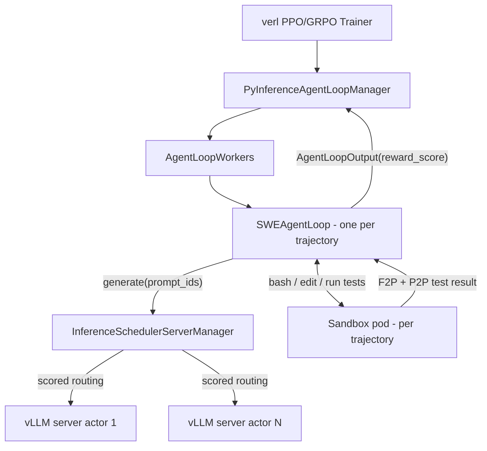

# Running SWE-bench RL Training with verl and the Scheduler

This guide describes how to run an agentic RL training job on [verl](https://github.com/volcengine/verl) using SWE-bench-style software engineering tasks, with rollout inference routed through `py-inference-scheduler`.

**Status**: Validated end-to-end. Everything described here is implemented ([integration/verl/swe](../integration/verl/swe/)) and has run real training: GRPO on calibrated R2E instances with graded solves (Qwen2.5-7B: 0.3% solve rate; Qwen3-32B: **4.9%**, 19/384), zero sandbox errors across full runs, and a first scheduler A/B showing **−10% per-trajectory generation latency** with prefix-aware routing (Phase 6). The doc doubles as the operational runbook — every failure mode listed was actually hit — and the [`swe-rl` skill](../.claude/skills/swe-rl/SKILL.md) wraps the day-to-day operations (preflight → launch → monitor → recover).

## Why SWE-bench is the right workload for the scheduler

SWE agent rollouts are close to a worst case for naive rollout routing, and a best case for prefix-aware scheduling:

- **Growing prefixes**: every agent turn re-sends the entire conversation (system prompt + issue + all prior tool output). A trajectory with 30 turns re-prefills its history 30 times unless it lands on a replica that has the prefix cached.
- **Shared prefixes across siblings**: GRPO samples `rollout.n` trajectories per issue, all sharing the same system prompt + issue context.
- **Extreme long tail**: trajectories vary from 2 turns (model gives up) to 50+ turns with test runs in between. This is exactly the sampler-imbalance problem on the [roadmap](../README.md#roadmap).

## Prior art

| Resource | What it gives us |
|---|---|
| [verl Agentic RL docs](https://verl.readthedocs.io/en/latest/start/agentic_rl.html) | Core async rollout + AgentLoop architecture |
| [verl Agent Loop internals](https://verl.readthedocs.io/en/latest/advance/agent_loop.html) | `AgentLoopBase` interface, token-in/token-out contract |
| [Alibaba ACK verl + SWE-bench guide](https://help.aliyun.com/en/ack/training-agentic-reinforcement-learning-on-ack-using-the-verl-framework) | End-to-end k8s reference: sandbox pods, reward design, GRPO params, troubleshooting. Note: they inject an HTTP proxy to capture tokens; we don't need one (see below). |
| [Practitioner's Guide to Multi-turn Agentic RL](https://arxiv.org/abs/2510.01132) | Tuned hyperparameter recipe on verl, incl. SWE-Gym |
| [DeepSWE recipe](https://www.together.ai/blog/deepswe) | Algorithm tricks for convergence (clip-high, no KL, compact filtering) and reward design |
| [SWE-Gym](https://github.com/SWE-Gym/SWE-Gym) / [R2E-Gym](https://github.com/R2E-Gym/R2E-Gym) | Training environments with per-instance Docker images |

## Architecture

verl's agent loop stack is client/server: agent loops (clients) call `generate(prompt_ids) -> response_ids` against a pool of vLLM/SGLang server actors. Our [existing verl integration](../integration/verl/README.md) already replaces verl's load balancer at exactly this seam — [`InferenceSchedulerServerManager._acquire_server`](../integration/verl/verl_hook.py) routes every `generate` call through the scheduler engine, at the **token level**, with `prompt_ids` available for prefix scoring.

This means the SWE agent loop rides on top of the existing hook unchanged: any agent loop that calls `server_manager.generate(...)` gets scheduler routing for free. Unlike proxy-based setups (e.g. the Alibaba guide's ProxyServer), no HTTP hop or token-capture middleware is needed — verl's native path is already token-in/token-out, which is what RL training requires for correct advantage computation.



One design note on stickiness: verl's native `LLMServerClient` pins a trajectory to one server for all of its turns. Our hook re-routes **every** `generate` call instead. With the `prefix_cache` scorer weighted appropriately, follow-up turns naturally land on the replica holding the prefix ("soft stickiness"), while the scheduler retains freedom to move work when a replica saturates — this is the behavior we want to measure.

---

## Phase 0 — Cluster foundation

Everything in the [verl integration prerequisites](../integration/verl/README.md#prerequisites--cluster-requirements-step-1) applies (KubeRay cluster, shared `/tmp/metrics` volume, `scheduler-config` ConfigMap). SWE-bench adds:

1. **Agent sandboxes**: install [agent-sandbox on GKE](https://docs.cloud.google.com/kubernetes-engine/docs/how-to/how-install-agent-sandbox#update-existing-gke-cluster). Sandboxes give each trajectory an isolated environment to run untrusted, model-generated code. Findings from bringing this up (July 2026, GKE 1.35):
   - The managed install ships a `secure-sandbox-policy` ValidatingAdmissionPolicy requiring gVisor, `runAsNonRoot`, dropped capabilities, resource limits, and the gVisor nodeSelector + toleration on every Sandbox.
   - **R2E/SWE task images require root** — the uv-managed interpreter lives under `/root` (mode 700) and `/testbed` is root-owned, so under `runAsNonRoot` the agent can neither run tests nor edit code. The policy binding excludes the `agents-system` namespace: run SWE sandboxes there as root while keeping gVisor, no SA token, and dropped caps voluntarily (root-inside-gVisor is the standard posture for these images). Validated template: [swe_sandbox_example.yaml](../configs/swe_sandbox_example.yaml).
   - Measured startup latency (474 MB R2E image): **~43 s cold** (~30 s of it image pull, first pull through the mirror), **~34 s** with AR cache warm but node cold (pull is dominated by AR→node transfer/extract, not the Docker Hub fetch), **~5–10 s** when the image is already on the node. With ~4.6k distinct training images, node-cache hits are rare, so budget ~35–45 s per sandbox: per-trajectory creation is viable, warm pools add little (they can't pre-stage 4.6k images), and co-scheduling the `rollout.n` siblings that share an image onto the same nodes is the real optimization lever.
2. **A CPU node pool for sandboxes**: rollouts need `train_batch_size × rollout.n` concurrent sandboxes at peak. Sandboxes are CPU/memory bound (git, pip, pytest) — keep them off the GPU pool. Enable autoscaling; VerlTool and DeepSWE both report needing 1000+ CPU cores at scale. (The GKE agent-sandbox install creates a gVisor node pool — size it for this concurrency.)
3. **Image mirror**: SWE task images are per-instance and large (1–5 GiB); R2E-Gym-Lite alone is ~3.2k unique images, so bulk-copying into Artifact Registry is impractical. Use an AR **remote repository** — a pull-through cache of Docker Hub — instead: no bulk transfer, images cache on first pull, and GKE pulls at GCP-internal speed afterward.

   ```bash
   gcloud artifacts repositories create swe-mirror \
       --repository-format=docker --location=<REGION> \
       --mode=remote-repository --remote-docker-repo=DOCKER-HUB
   ```

   Point the dataset at the mirror when preprocessing (Phase 2):

   ```bash
   python integration/verl/helpers/prepare_swe_dataset.py --local_save_dir ~/data/swe \
       --registry_rewrite "namanjain12/=<REGION>-docker.pkg.dev/<PROJECT>/swe-mirror/namanjain12/" \
       --registry_rewrite "docker.io/=<REGION>-docker.pkg.dev/<PROJECT>/swe-mirror/"
   ```

   Then pre-warm the cache so rollouts never cold-pull from Docker Hub: [list_swe_images.py](../integration/verl/helpers/list_swe_images.py) emits the unique image refs from the parquet files, and [swe_image_prewarm_job.yaml](../configs/swe_image_prewarm_job.yaml) is a sharded in-cluster Job that pulls them through the mirror (layers stream to `/dev/null`; nothing lands on node disk):

   ```bash
   python integration/verl/helpers/list_swe_images.py \
       ~/data/swe/train.parquet ~/data/swe/test.parquet > /tmp/swe_images.txt
   kubectl create configmap swe-image-list --from-file=images.txt=/tmp/swe_images.txt
   kubectl apply -f configs/swe_image_prewarm_job.yaml
   ```

   Caveats: the *initial* caching pulls still count against Docker Hub anonymous rate limits — if the pre-warm Job logs 429s, attach Docker Hub credentials to the remote repo (Secret Manager upstream credentials). The node/pod service account needs `artifactregistry.reader` on the mirror. And the AR cache is not the node image cache — sandbox pods still pull from AR on first use, so expect warm-up on the first rollout wave per node.
4. **Shared storage** for the parquet datasets and checkpoints, reachable from all Ray workers (GCS FUSE or PVC).

## Phase 1 — Smoke test with the existing example

Before adding SWE variables, verify the cluster + integration with the stock math walkthrough from the [integration README](../integration/verl/README.md#running-a-training-job-step-3). This proves KubeRay, the scheduler hook, metrics scraping, and FSDP all work. Only then move on.

## Phase 2 — Dataset preparation

**Do not train on SWE-bench Verified** — it is the community's eval set. The standard recipe:

- **Train**: [R2E-Gym](https://github.com/R2E-Gym/R2E-Gym) (8.1k procedurally generated instances). Filter out instances from repos that appear in SWE-bench Verified (e.g. sympy) to avoid contamination.
- **Eval**: [SWE-bench Verified](https://huggingface.co/datasets/princeton-nlp/SWE-bench_Verified) (500 instances) as `val_files`, run at `trainer.test_freq`.

Convert to verl parquet with a preprocessing script (pattern: `examples/data_preprocess/*.py` in verl). Each row needs:

| Column | Content |
|---|---|
| `prompt` | Chat messages: system prompt (agent instructions + tool schema) and user message (issue text) |
| `agent_name` | `"swe_agent"` — selects our custom agent loop per sample (verl falls back to `rollout.agent.default_agent_loop` when absent) |
| `reward_model` | `{"style": "rule", "ground_truth": ""}` (reward comes from the sandbox, not from a comparator) |
| `extra_info` | `instance_id`, `dataset_kind` (`r2e` \| `swebench`), sandbox image ref, `repo`, `base_commit`, and the grading spec: `expected_output_json` for R2E-Gym rows; `fail_to_pass`/`pass_to_pass` **plus `test_patch`** for SWE-bench rows — official grading applies `test_patch` (it contains the fail-to-pass tests) before running the suite. The gold `patch` is deliberately *not* carried: no answers in the dataset. All JSON/text-encoded strings so both splits share one flat schema. |

The `extra_info` fields are delivered to the agent loop's `run(**kwargs)` as dataset fields, which is how the loop knows which sandbox image to claim and which tests to grade with. Note the grading difference: R2E-Gym ships `expected_output_json` (test name → expected status after a correct fix) instead of SWE-bench's F2P/P2P lists, so the reward step branches on `dataset_kind`.

This is implemented in [prepare_swe_dataset.py](../integration/verl/helpers/prepare_swe_dataset.py):

```bash
# full run
python integration/verl/helpers/prepare_swe_dataset.py --local_save_dir ~/data/swe

# smoke test (streams a small slice instead of downloading everything)
python integration/verl/helpers/prepare_swe_dataset.py \
    --local_save_dir /tmp/swe_data --max_train 50 --max_eval 20
```

It applies the contamination filter automatically (drops R2E-Gym rows whose repo appears in the eval set) and supports `--registry_rewrite OLD=NEW` to point image refs at an Artifact Registry mirror once one exists. Caveat: with `--max_eval` the filter only sees the sampled eval repos, so contamination filtering is only complete on a full run.

## Phase 3 — The SWE agent loop

Implemented in [integration/verl/swe/](../integration/verl/swe/). Four modules, with only the loop itself importing verl:

| Module | Role |
|---|---|
| [swe_agent_loop.py](../integration/verl/swe/swe_agent_loop.py) | The verl `AgentLoopBase` implementation; `@register("swe_agent")` |
| [scaffold.py](../integration/verl/swe/scaffold.py) | Pure helpers: bash-block protocol, observation formatting, diff filtering, system prompt |
| [pristine_grader.py](../integration/verl/swe/pristine_grader.py) | Scores an agent patch in a fresh sandbox (anti-reward-hacking) |
| [sandbox.py](../integration/verl/swe/sandbox.py) | Sandbox CR client (create/wait/exec/write_file/delete); shared by loop + grader + calibration |

### Registration

```yaml
# integration/verl/examples/swe_agent_loop.yaml
- name: swe_agent
  _target_: integration.verl.swe.swe_agent_loop.SWEAgentLoop
```

Passed with `+actor_rollout_ref.rollout.agent.agent_loop_config_path=integration/verl/examples/swe_agent_loop.yaml`. Dataset rows select it via `agent_name == "swe_agent"`.

### Rollout flow

`SWEAgentLoop.run(sampling_params, **kwargs)`:

1. **Sandbox** — create an agent-sandbox pod from the instance image in `agents-system` ([swe_sandbox_rbac.yaml](../configs/swe_sandbox_rbac.yaml) grants the Ray SA cross-namespace access).
2. **Prompt** — build the system prompt (task framing + bash-block protocol from `scaffold.py`) and tokenize.
3. **Loop** until submit / max-turns / token-budget:
   - `server_manager.generate(prompt_ids=...)` — the call the scheduler routes (prefix-aware).
   - Decode assistant tokens → parse the last fenced bash block → execute in the sandbox with a per-command timeout (`SWE_CMD_TIMEOUT_S`, default 60s) → middle-truncate output (`SWE_OBS_MAX_CHARS`, default 6k chars) → tokenize as a delta user message via `apply_chat_template(remove_system_prompt=True)` → append with mask 0.
   - If no bash block: return a protocol nudge as the observation (recoverable).
   - If the bash block is `submit`: break and grade.
4. **Pristine grading** — `git diff HEAD` in the rollout sandbox → `filter_patch()` strips test-path chunks → apply the filtered diff in a *fresh* sandbox → run the graded tests → `reward_score` back on `AgentLoopOutput`.
5. **Cleanup** — delete both sandboxes; return the output with `extra_fields: {swe_reason, swe_submitted}`.

### Token discipline

- LLM tokens are never re-tokenized — verl requires the exact token ids that flowed through the model for advantage computation.
- Observations use `apply_chat_template(remove_system_prompt=True)` on the delta message only (tool-agent-loop convention), appended with `response_mask=0` and `response_logprobs=0.0`.
- Response is truncated to `rollout.response_length` (budget ~28k for SWE trajectories); turns that would overflow it terminate the episode.

### Environment variables (tuning knobs without a config change)

| Var | Default | Purpose |
|---|---|---|
| `SWE_SANDBOX_NAMESPACE` | `agents-system` | Namespace for rollout + grading sandboxes |
| `SWE_CMD_TIMEOUT_S` | `60` | Per-command timeout in the rollout sandbox |
| `SWE_OBS_MAX_CHARS` | `6000` | Character cap for observation truncation |

### Prerequisites

- RBAC: `kubectl apply -f configs/swe_sandbox_rbac.yaml` — lets the Ray pods (default/default SA) manage Sandboxes in `agents-system`.
- The `kubernetes` Python package available in the Ray runtime env ([runtime-env-swe.yaml](../integration/verl/examples/runtime-env-swe.yaml) includes it).

### Validation status (2026-07-30): PASSING end-to-end without GPUs

[integration_check.py](../integration/verl/swe/integration_check.py) runs the real loop on the head pod with a *scripted* model (explore → write the gold fix via heredoc → submit) against real sandboxes and the installed verl build:

```bash
# copy the package to the head pod, then:
kubectl exec <head-pod> -- bash -c "cd /tmp/swe_itest && PYTHONPATH=/tmp/swe_itest \
  python3 -m integration.verl.swe.integration_check \
  --parquet /home/ray/data/swe/train.parquet --instance aiohttp-f0d74880deec"
# => reward=1.0 extra={'swe_reason': 'pass', 'swe_submitted': True} ... INTEGRATION CHECK: PASS
```

This validates the verl 0.9.0.dev `AgentLoopBase` contract, sandbox lifecycle via in-cluster RBAC, observation tokenization, and the full submit → diff → pristine-grade → reward-1.0 path. Re-run it whenever verl or the loop changes.

> [!IMPORTANT]
> **R2E images ship with a dirty git state** (the harness's baked-in bug edits to tracked files). The loop commits a baseline (`BASELINE_CMD`) right after sandbox start so `git diff HEAD` is agent-only — without this, the diff includes image-baked changes and fails to apply in the fresh grading sandbox.

## Phase 4 — Reward

Sparse outcome reward, computed inside the sandbox at trajectory end:

- **+1.0** — SWE-bench rows: all `fail_to_pass` tests now pass **and** all `pass_to_pass` tests still pass. R2E rows: the per-test status map from running `/r2e_tests` **exactly equals** `expected_output_json`. Time-capped (~5 min for training, vs 30 min in official eval).
- **0.0** otherwise (including timeout, crash, or no patch).

> [!IMPORTANT]
> **R2E grading is exact status matching, not "all tests pass".** Validated in-sandbox on `aiohttp-f0d74880deec`: the spec expects `test_add_route_with_invalid_re` to remain FAILED *even after a correct fix* — an "all tests green" reward would score gold patches as failures. Pre-fix, exactly one test (the fail-to-pass one) mismatches the spec, so reward is 0 as intended. Mechanics: `cd /testbed && .venv/bin/python -m pytest /r2e_tests --junitxml=/tmp/report.xml` and compare per-test statuses; the graded suite runs in seconds, so the 5-minute cap is generous headroom for slow repos.

**Both grading paths are validated end-to-end with gold patches** (2026-07-28, real sandboxes on the cluster):

- **R2E** (`aiohttp-f0d74880deec`): pre-fix → 62/2 pass/fail, spec mismatch, reward 0. Gold commit applied → 63/1 with the sole failure being the expected-FAILED test → exact spec match, reward 1.
- **SWE-bench** (`astropy__astropy-12907`): `git apply test_patch` → both F2P tests fail pre-fix (reward 0). Gold patch applied → F2P 2/2 and P2P 13/13 pass (reward 1). Run tests via the image's conda env: `/opt/miniconda3/envs/testbed/bin/python -m pytest <test ids>`.

Implementation notes from the validation: write files into sandboxes via exec streams, **not `kubectl cp`** — the sandbox drops `CAP_CHOWN`, so tar exits nonzero even though file content lands. Grade order for SWE-bench rows is `test_patch` → candidate patch → F2P + P2P.

**Decided: grade against a pristine state.** The agent is root in the container where tests live, so a policy can learn to delete failing tests or patch pytest. The agent loop must extract the agent's diff (filtered to non-test paths), then apply and grade it in a **fresh sandbox** the policy never touched (~35–45 s extra per trajectory, fully parallel).

Grading and calibration tooling lives in [integration/verl/swe/](../integration/verl/swe/):

- [grader.py](../integration/verl/swe/grader.py) — pure grading logic (junitxml → status map → `grade_r2e` exact-match / `grade_swebench` F2P+P2P), unit-tested in [tests/test_swe_grader.py](../tests/test_swe_grader.py). Name mapping handles class-based, module-level, parametrized, and underscore-prefixed (`_BaseTest`) tests.
- [sandbox.py](../integration/verl/swe/sandbox.py) — Sandbox CR client (create/wait/exec/write_file/delete) encoding the validated pod shape. Gotchas baked in: file writes go over exec+base64 (`CAP_CHOWN` breaks `kubectl cp`), exec retries transient websocket races, and clients must be **per-thread** — the kubernetes client's GKE auth races when shared across threads.
- [calibrate.py](../integration/verl/swe/calibrate.py) — the **calibration sweep**: runs the pre-fix suite for every instance in a real gVisor sandbox and keeps only instances that are (1) key-exact vs the spec, (2) deterministic across two runs, (3) not already solved pre-fix, (4) within the time cap. Catches runc→gVisor drift and flaky tests before they poison GRPO groups, and emits a keep-list to filter the training parquet with. The first sweep surfaced two systematic R2E spec conventions, now baked into the grader's key normalization: specs mangle `::` inside parametrized values into `.` (their node-id splitting), and **skipped tests are excluded from specs** (platform-conditional tests skip under Linux/gVisor), so the grader drops SKIPPED before comparing:

  ```bash
  uv run --with kubernetes --with pandas --with pyarrow python \
      -m integration.verl.swe.calibrate --parquet <train.parquet> \
      --out calibration.jsonl --concurrency 24
  ```

Return it via `AgentLoopOutput.reward_score` (field verified present in verl). Optional shaping (small bonuses for patch minimality / speed, per the ACK guide) only after the sparse signal is confirmed working. DeepSWE-style *compact filtering* — masking loss on trajectories that hit max-context/timeout instead of scoring them 0 — is a known stabilizer worth adopting if training oscillates.

> [!TIP]
> "All rewards are 0.0" is the most common failure mode and usually means broken sandbox plumbing (image, test command, network policy), not a bad policy. Validate the reward path standalone first: replay a known-good gold patch through the grading step and confirm it returns 1.0 before any RL is run.

## Phase 5 — Training configuration

Ready to run: [run_swe.sh](../integration/verl/examples/run_swe.sh) with [runtime-env-swe.yaml](../integration/verl/examples/runtime-env-swe.yaml):

```bash
ray job submit --address http://localhost:8265 \
    --runtime-env integration/verl/examples/runtime-env-swe.yaml \
    -- bash integration/verl/examples/run_swe.sh
```

A 7B–8B instruct model (Qwen2.5-7B-Instruct in the script) is the proven starting point for SWE RL on a single 8-GPU node. The scheduler-hook override is left commented in the script until the hook is ported to the cluster's verl version (see Version compatibility). Deltas vs the math example that matter:

```bash
swe_data_dir=$HOME/data/swe   # output of prepare_swe_dataset.py (Phase 2)

python3 -m verl.trainer.main_ppo \
    algorithm.adv_estimator=grpo \
    data.train_files=$swe_data_dir/train.parquet \
    data.val_files=$swe_data_dir/test.parquet \
    data.return_raw_chat=True \
    data.max_prompt_length=4096 \
    data.max_response_length=28672 \        # trajectories are long; budget 32k total
    data.train_batch_size=64 \              # issues per step; sandbox pool must cover batch × n
    actor_rollout_ref.rollout.mode=async \
    actor_rollout_ref.rollout.name=vllm \
    actor_rollout_ref.rollout.n=8 \         # GRPO group size = sandboxes per issue
    actor_rollout_ref.actor.use_kl_loss=False \   # DeepSWE/DAPO: no KL for agentic tasks
    actor_rollout_ref.actor.clip_ratio_high=0.28 \
    +actor_rollout_ref.rollout.agent.agent_loop_config_path=integration/verl/examples/swe_agent_loop.yaml \
    actor_rollout_ref.rollout.disable_log_stats=False \
    +actor_rollout_ref.rollout.agent.agent_loop_manager_class=integration.verl.verl_hook.PyInferenceAgentLoopManager \
    ...
```

Long-context notes: enable `use_remove_padding`, sequence parallelism if 32k contexts OOM, and keep `gpu_memory_utilization` moderate (0.4–0.6) since training and rollout share GPUs. Hyperparameter fallback: the [practitioner's guide](https://arxiv.org/abs/2510.01132) recipe.

## Phase 6 — Measuring scheduler impact

The point of this exercise for the repo: quantify prefix-aware routing on a real agentic RL workload. Run A/B at identical config:

- **Baseline**: drop the `agent_loop_manager_class` override → verl's native load balancer (sticky least-loaded).
- **Treatment**: scheduler hook with a profile weighting `prefix_cache` (see [scheduler.yaml](../integration/verl/examples/scheduler.yaml); tune weights per the [customization guide](./scheduler_customization.md)).

Compare, per step (all already emitted — see the [integration README log reference](../integration/verl/README.md#4-verifying-results-step-4)):

- `timing_s/gen` and `perf/throughput` — rollout wall clock / sampling throughput (headline number)
- `timing_s/agent_loop/slowest/generate_sequences` — tail latency, where sampler imbalance shows up
- `num_turns/*` and `timing_s/agent_loop/tool_calls/*` — workload shape sanity check
- vLLM prefix-cache hit rate from the scraped backend metrics — the mechanism behind any win

### First A/B results (2026-08-27)

**Conditions**: 12 GRPO steps per arm, batch 8 × n 8 (64 concurrent trajectories), Qwen2.5-7B, 4 vLLM endpoints (TP2) on one 8-GPU node, calibrated 3,315-instance set, `data.seed=42` (identical instance order), treatment profile = `prefix_cache` only. W&B: `ab7b_base` (`xuufp5zy`) vs `ab7b_sched` (`pqcozz5f`). Step 1 dropped from aggregates (cold caches).

| Metric (steps 2–12 mean) | Baseline | Scheduler | Δ | Consistency |
|---|---|---|---|---|
| Mean generation / trajectory (s) | 21.2 | 19.1 | **−10.0%** | scheduler better **8/11 steps** |
| Slowest-trajectory generation (s) | 29.3 | 24.6 | −16.1% | 5/11 (inconsistent) |
| Rollout wall clock `timing_s/gen` (s) | 788 ± 183 | 910 ± 219 | +15.5% | within 1σ → **noise** |
| Throughput (tok/s) | 98.3 | 89.2 | −9.3% | noise (tracks wall clock) |
| Turns / trajectory (sanity) | 47.5 | 46.8 | −1.5% | comparable work ✓ |
| Response length (sanity) | 8,955 | 9,186 | +2.6% | comparable work ✓ |

**Reading**: prefix-aware routing delivered a consistent **~10% per-trajectory generation-latency improvement** — the metric routing directly controls, averaged over ~700 trajectories/arm. End-to-end rollout wall clock showed **no verdict**: at 64-concurrency it is sandbox-time-dominated and per-step variance (±25%) from stochastic trajectory outcomes swamps any routing effect (the +15% delta is within noise, 3/11 steps favoring either arm pattern-free).

**Caveats**: single run per arm; rollouts stochastic even at fixed seed; vLLM prefix-cache hit rates not recoverable from driver logs (engine processes log separately) — treatment routing verified via scheduler `Selected endpoint` decisions instead.

**What would sharpen the result**: (1) CPU quota increase → 256–512 concurrency, where generation contends and routing moves wall clock; (2) repeat runs per arm for error bars; (3) surface engine cache-hit metrics into step telemetry; (4) shrink sandbox time (persistent exec sessions, image locality) so generation is a larger share of the step.

## Version compatibility

The hook supports **verl v0.7.1 (legacy) and v0.9.x (modern) layouts, auto-detected at import** ([compat notice](../integration/verl/README.md#compatibility-notice)). The modern port was required because 0.9.x moved routing into a `GlobalRequestLoadBalancer` Ray actor (`verl/workers/rollout/llm_server.py`) that owns the server registry; the hook's client bootstraps its endpoint set by draining the balancer once at first use, then routes via the scheduler engine with verl's LB as fallback. Validated GPU-free on the cluster's **0.9.0.dev** build by [hook_compat_check.py](../integration/verl/hook_compat_check.py) — PASS: 3 endpoints bootstrapped, all same-prefix requests prefix-routed to one server, inflight and LB counters clean. The **SWEAgentLoop is likewise verified against 0.9.0.dev** ([integration_check.py](../integration/verl/swe/integration_check.py)) and tolerates older builds where `generate` returned a bare token list. One robustness fix that came out of this: the vLLM/SGLang engine patches now skip on *any* import failure, not just ImportError — CPU-only nodes (the Ray head) raise `AttributeError` from triton during vLLM import.

## Open items

- [x] Choose training set → R2E-Gym (train) + SWE-bench Verified (eval)
- [x] Dataset preprocessing script → [prepare_swe_dataset.py](../integration/verl/helpers/prepare_swe_dataset.py)
- [x] Image mirror → AR remote repo (pull-through cache) + pre-warm Job ([list_swe_images.py](../integration/verl/helpers/list_swe_images.py), [swe_image_prewarm_job.yaml](../configs/swe_image_prewarm_job.yaml)); pre-warm launched over all 5,078 images 2026-07-28 — check `kubectl logs -l job-name=swe-image-prewarm` for `FAILED` lines (Docker Hub rate limits)
- [x] Full preprocessing run → `/home/ray/data/swe/{train,test}.parquet` on the Ray head pod (4,578 train / 500 eval; contamination filter saw all 12 eval repos, 0 overlaps). Caveat: the cluster's `data` volume is an emptyDir — head-pod-local, not shared with workers
- [x] Sandbox lifecycle → measured (43 s cold / 34 s AR-warm / ~5–10 s node-warm; per-trajectory creation viable, warm pools low-value; see Phase 0). Validated template: [swe_sandbox_example.yaml](../configs/swe_sandbox_example.yaml)
- [x] `SWEAgentLoop` implementation in [integration/verl/swe/](../integration/verl/swe/); scaffold, pristine grader, sandbox client, RBAC, 12 unit tests
- [x] End-to-end loop validation without GPUs → [integration_check.py](../integration/verl/swe/integration_check.py) PASSING on the head pod (scripted gold-fix rollout → reward 1.0)
- [x] Training entrypoint → [run_swe.sh](../integration/verl/examples/run_swe.sh) + [runtime-env-swe.yaml](../integration/verl/examples/runtime-env-swe.yaml)
- [x] Calibration sweep v2 complete (4,578 instances): 3,293 kept → `train_calibrated.parquet` on all pods (used by the 20-step run). Recoverable later: ~824 tail-repo key-mismatches (one more spec-key convention to decode) + ~422 transient sandbox-errors worth a retry pass (~+1,200 instances)
- [x] Port [verl_hook.py](../integration/verl/verl_hook.py) to verl 0.9.x → dual-layout hook, [hook_compat_check.py](../integration/verl/hook_compat_check.py) PASSING on the cluster build (bootstrap + prefix-sticky routing + clean accounting)
- [x] First GPU smoke run → **SUCCEEDED 2026-07-30** (`raysubmit_AtVLsMFd4uHUZL1r`, W&B project `swe-rl-scheduler`, run `qwen7b_r2e_smoke_2`): 2 GRPO steps, batch 8 × n 2, Qwen2.5-7B on 8×H100. Findings:
  - Real agentic rollouts: `num_turns` mean 37–44, max 65; response mean ~6.5k tokens, max 27k (near budget)
  - **Token discipline proven under real generation**: `rollout_probs_pearson_corr = 0.999` — loop token/mask accounting matches trainer recompute
  - Rewards all 0.0 (expected for untuned 7B on R2E; `grad_norm = 0` on all-zero-advantage batches is normal GRPO cold-start)
  - **Sandbox exec dominates wall clock**: `tool_calls` mean 386 s/trajectory vs 26 s of generation; step time ~1,050 s. Sandbox throughput, not GPU, is the current bottleneck — sizing/locality work will pay off more than anything GPU-side at small scale
  - Fixes that came out of smoke iteration: data must exist on **all** Ray pods (emptyDir is per-pod; first attempt died on a worker-scheduled TaskRunner), empty-response trajectories crash verl's padding (loop now emits one loss-masked pad token), sandbox boot now overlaps the first generate, `SWE_SANDBOX_WAIT_S` default 600 s, and **autoscaling enabled on `agent-sandbox-pool` (3→24 nodes)** after the calibration sweep starved the smoke run's sandboxes
  - **W&B history can silently vanish** (run exists with config + system stats, zero metric rows, state "crashed"): the SDK→service channel appears to die during the long idle gaps between steps on Ray + wandb-core 0.22, while service-side stats keep flowing. SDK and network proven healthy via minimal probes in the same pod. Recovery: the console logs always carry full per-step metrics — [backfill_wandb.py](../integration/verl/helpers/backfill_wandb.py) parses `step:N - k:v` lines from the ray job log and re-logs them into the same run (`--run_id`). Run it as a post-job safety net until the upstream cause is fixed; a newer wandb via runtime-env `pip:` is worth a try next run
- [x] Reward-path validation with gold patches → both dataset kinds validated 0→1 in real sandboxes (R2E exact-match; SWE-bench test_patch + F2P/P2P; see Phase 4)
- [x] Pristine-state grading design → fresh-sandbox grading decided; grader + sandbox client + calibration tooling built ([integration/verl/swe/](../integration/verl/swe/)); full 4,578-instance sweep launched 2026-07-30 (results land in `/tmp/calibration_full.jsonl` on the workstation) — filter the train parquet with the keep-list when it finishes
- [x] **First learning signal** — 20-step run SUCCEEDED 2026-08-03 (`qwen7b_r2e_20step_1`, W&B run `go8e82dc`): batch 8 × n 4 on the calibrated set, 3.6 h, **zero sandbox errors across 640 trajectories**. Steps 4 and 7 each solved one instance (`critic/score/max = 1.0`) → first mixed GRPO groups → first real policy-gradient updates. Step times 525→656 s (calibrated data + free pool + node-warm images + concurrent boot cut steps ~40% vs smoke despite 2× trajectories); no leak signature. W&B synced live through step 18 (short steps stay under the idle timeout; final steps backfilled). Next signal levers: stronger base model (Qwen3-14B → Qwen3-Coder-30B-A3B), easier-first curriculum via R2E difficulty metadata, larger `n`.
- [x] **Worker pods are pets — make them cattle.** The Ray GPU workers carry manual state (verl editable install @ pinned commit at `/tmp/verl`, parquets at `/home/ray/data/swe`, HF model cache). GKE node repairs replaced two workers in three days (2026-07-31, 2026-08-02); each fresh pod broke jobs (`ModuleNotFoundError: No module named 'verl'`, missing parquets) until re-provisioned by hand:
  ```bash
  kubectl exec <worker> -- sh -c 'mkdir -p /tmp/verl && cd /tmp/verl && git clone https://github.com/volcengine/verl.git && cd verl && git checkout <PINNED_COMMIT> && pip install -e . --no-deps'
  kubectl exec <head> -- tar cf - -C /home/ray/data swe | kubectl exec -i <worker> -- tar xf - -C /home/ray/data
  ```
  Durable fix (implemented 2026-08-26): **bake verl@commit into the Ray image** ([build/ray-image/Dockerfile](../build/ray-image/Dockerfile) — digest-pinned base, verl fetched at the validated commit, `kubernetes` included; build with `gcloud builds submit build/ray-image --tag <REGION>-docker.pkg.dev/<PROJECT>/ray-images/verl-swe:<COMMIT>-v1`) and **sync datasets from GCS at pod boot** via a `data-downloader` initContainer on every group ([verl-inference-scheduler.yaml](../integration/verl/examples/verl-inference-scheduler.yaml)); grant the node compute SA `roles/storage.objectViewer` on the bucket. The cluster's Aug-10 rebuild + a third node replacement wiped ALL pod state (including the calibration keep-list, whose only copies lived in emptyDirs and /tmp) — datasets now live at `gs://<bucket>/data/{swe,deepmath,deepscaler}` and pods self-provision. Note `verlai/verl:vllm011.latest` is a moving tag; never use it directly.
- [x] **Qwen3-32B validated** (2026-08-28, `qwen3_32b_r2e_1`, W&B `5ecb0uqg`): 6 steps, TP4 + full FSDP offload on an H100-80GB node (fits the tight case), thinking mode disabled via `+data.apply_chat_template_kwargs.enable_thinking=false`. **19/384 solves (4.9%) vs 7B's 0.3% — 16×**; solves in 5/6 steps, mixed GRPO groups nearly every step. Step times ~7B-class. 32B is the training base going forward.
- [x] A/B benchmark → first result 2026-08-27 (see Phase 6): scheduler cut per-trajectory generation latency **−10% (8/11 steps consistent)**; rollout wall clock inconclusive at quota-capped 64-concurrency (sandbox-dominated, noise > effect). Sharpening path: quota bump → higher concurrency, repeat runs, engine cache-hit telemetry
- [x] Skill conversion → project skill at [.claude/skills/swe-rl/SKILL.md](../.claude/skills/swe-rl/SKILL.md) (preflight → launch → monitor → recover runbook) backed by [preflight.py](../integration/verl/swe/preflight.py), a deterministic checker for sandbox env + RBAC + live sandbox smoke test + verl-on-all-pods + parquet replicas + hygiene (validated: 20 pass / 0 fail on the cluster, and it caught a leaked grading sandbox on its first run)
